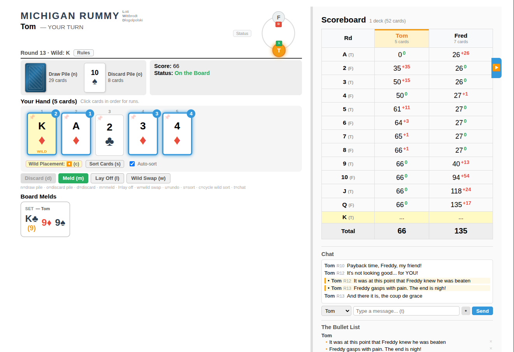

# Michigan Rummy — LWD Edition

A digital version of Michigan Rummy, customized for the **L**ott, **W**ittbrodt, and **D**logolpolski families. Play locally with bots, online with friends, or replay saved games.



## How the Game Works

Play 13 rounds, one for each card rank (Ace through King). Each round, that rank is **wild**. Players draw, meld, and discard to empty their hand. The player who goes out scores 0 for the round; everyone else scores the face value of cards remaining in hand. **Lowest total score after 13 rounds wins.**

### Key Rules

- **First player** gets 8 cards and starts by melding or discarding (no draw)
- **All other players** get 7 cards and must draw before playing
- **Melds**: Sets (3-4 of a kind) or runs (3+ consecutive in one suit)
- **Lay off**: After melding ("on the board"), add cards to any board meld
- **Wild swap**: Replace a wild in a board meld with the natural card
- **Scoring**: Number cards = face value, J/Q/K = 10, Aces = 15, Wilds = 20

### Configurable Rules

| Rule | Description |
|------|-------------|
| Adjacent Wilds | Allow wild cards next to each other in runs |
| Large Sets | Allow sets larger than 4 cards (multi-deck games) |
| Must Play Pickup | Discard pile pickup must be played immediately |
| Lay-off Hints | Highlight available lay-off opportunities |
| Wild Swap Hints | Highlight available wild swap opportunities |

## Getting Started

### Prerequisites

- **Node.js** 18+
- **npm** 9+

### Install

```bash
git clone <repo-url>
cd family-card-engine
npm install
```

### Run — Local Only (Single Player + Bots)

```bash
npm run dev
```

Opens the game at [http://localhost:3000](http://localhost:3000). Play locally on one device with AI bots or pass-and-play.

### Run — Multiplayer

```bash
npm run dev:multi
```

Starts both the Vite dev server (port 3000) and the boardgame.io multiplayer server (port 8001). Players on the same network can join via the online lobby.

### Build for Production

```bash
npm run build
```

Output goes to `dist/`. The multiplayer server serves the built frontend automatically in production mode:

```bash
NODE_ENV=production node server/index.js
```

### Run with Docker

Build and run in a single command:

```bash
docker compose up
```

Or manually:

```bash
docker build -t lwd-rummy .
docker run -d --name lwd-rummy -p 8001:8001 lwd-rummy
```

The game is available at `http://<your-ip>:8001`. All players on the network connect to the same URL.

To stop: `docker stop lwd-rummy && docker rm lwd-rummy`

To rebuild after code changes: `docker stop lwd-rummy && docker rm lwd-rummy && docker build -t lwd-rummy . && docker run -d --name lwd-rummy -p 8001:8001 lwd-rummy`

### Run Tests

```bash
npm test
```

Uses Jest with `--experimental-vm-modules` for ESM support.

## Game Modes

### Local Game

Play on a single device with 2-8 players. Any seat can be a human or a bot. Bots have three intelligence levels:

| Level | Description |
|-------|-------------|
| Newbie | Draws from deck, plays obvious melds, random discards |
| Average | Considers discard pile, smarter meld selection |
| Advanced | Strategic play — holds cards, optimizes discards |

Bot thinking speed is adjustable (0-7 seconds per action).

### Online Game

Multiplayer over the network via the boardgame.io lobby system:

1. Enter your name
2. Create a table or join an existing one
3. Wait for players (or fill seats with bots)
4. Game starts automatically when all seats are filled

Bot seats in online games can be configured with individual intelligence and speed settings.

### Replay Mode

Load a previously saved replay file (`.json`) and step through the game action by action. Features:

- Forward/backward navigation with cached snapshots
- Jump to any action
- **Play from here** — resume live play from any replay point
- Bots automatically resume when playing from a replay

## Features

### In-Game

- **Card pinning** — Pin cards to exclude them from sorting (click the pin icon or drag to reposition)
- **Auto-sort** — Automatically sort hand after every card change (checkbox next to Sort button)
- **Wild sort placement** — Choose where wild cards appear when sorting (left, right, or in-place)
- **Drawn card highlight** — Newly drawn card glows teal for 2 seconds
- **Draw pile indicators** — Pulsing green glow on draw/discard piles when it's time to draw
- **Click/drag to discard** — Click or drag a selected card onto the discard pile
- **Status window** — Scrollable log next to the table ring showing turn changes, draws, melds, and round results. Toggle visibility with the `x` button or the "Status" button; preference is saved.
- **Round-end popup** — Brief announcement when a player takes a round
- **Chat & bullets** — In-game chat with a "bullet list" for memorable moments (up to 3 per player)
- **Vote to end round** — Players can vote to end a round early when the deck has been flipped

### Export

- **Save Replay** — Download the full game as a `.json` file for later playback
- **Export PDF** — Generate a printable scoreboard with scores, rankings, medal badges, and bullet list (wide left margin for hole-punching)

### User Preferences

Saved automatically in the browser (localStorage):

- Wild sort mode
- Auto-sort preference
- Status window visibility
- Bot delay
- Include chat in replay
- Online player name

### Keyboard Shortcuts

| Key | Action |
|-----|--------|
| `n` | Draw from deck |
| `o` | Draw from discard pile |
| `d` | Discard selected card |
| `m` | Play selected cards as a meld |
| `l` | Lay off selected card |
| `w` | Swap wild with selected card |
| `s` | Sort hand |
| `c` | Cycle wild sort placement |
| `u` | Undo last lay off or wild swap |
| `t` | Focus chat input |
| `*` | Toggle admin controls |

### Admin Controls (Hidden)

Press `*` to toggle visibility of developer tools:

- boardgame.io debug panel
- Save Replay button
- Draw alert bar
- Seed entry field
- Replay file loader

## Project Structure

```
family-card-engine/
  server/
    index.js              # boardgame.io multiplayer server
  src/
    App.jsx               # Root component — mode routing
    main.jsx              # Entry point
    usePreference.js      # localStorage persistence hook
    pdfExport.js          # PDF scoreboard generation
    components/
      Board.jsx           # Main game board UI
      Card.jsx            # Card rendering
      LocalLobby.jsx      # Local game setup
      ManualGameBoard.jsx # Local game with bots
      MultiplayerGameBoard.jsx  # Online game wrapper
      ReplayBoard.jsx     # Replay viewer
      ErrorBoundary.jsx   # Error handling
    game/
      logic.js            # Core game rules and moves
      gameDefinition.js   # Server-compatible game definition
    bot/
      BotController.jsx           # Local bot AI driver
      MultiplayerBotController.jsx # Online bot AI driver
      strategies.js               # Bot decision logic
      meldFinder.js               # Meld detection engine
      botNames.js                 # Random bot name generator
    lobby/
      PlayerIdentity.jsx  # Name entry for online play
      OnlineLobby.jsx     # Match list and creation
      WaitingRoom.jsx     # Pre-game seat management
      CreateTableDialog.jsx # Table creation form
      TableCard.jsx       # Match info card
      lobbyApi.js         # Lobby REST API wrapper
      config.js           # Server URL configuration
    replay/
      ReplayEngine.js     # Deterministic game replay
      ReplayControls.jsx  # Replay playback controls
      replayStorage.js    # Replay file save/load
  dist/                   # Production build output
  Dockerfile              # Multi-stage production build
  docker-compose.yml      # Single-command Docker startup
  vite.config.js          # Vite configuration with proxy
  index.html              # HTML entry point
```

## Tech Stack

| Component | Technology |
|-----------|-----------|
| Game Engine | [boardgame.io](https://boardgame.io/) |
| Frontend | React 18 |
| Build | Vite 7 |
| PDF Export | jsPDF |
| Multiplayer Transport | Socket.IO (via boardgame.io) |
| Container | Docker (Node 22 Alpine, multi-stage) |
| Testing | Jest (ESM) |

## Network Architecture

In development, Vite proxies game API and WebSocket traffic to the boardgame.io server:

```
Browser :3000  ──→  Vite Dev Server :3000
                      ├── /games/*     ──→  boardgame.io Server :8001
                      └── /socket.io/* ──→  boardgame.io Server :8001 (WS)
```

In production, the boardgame.io server serves both the API and the static frontend from `dist/`.
